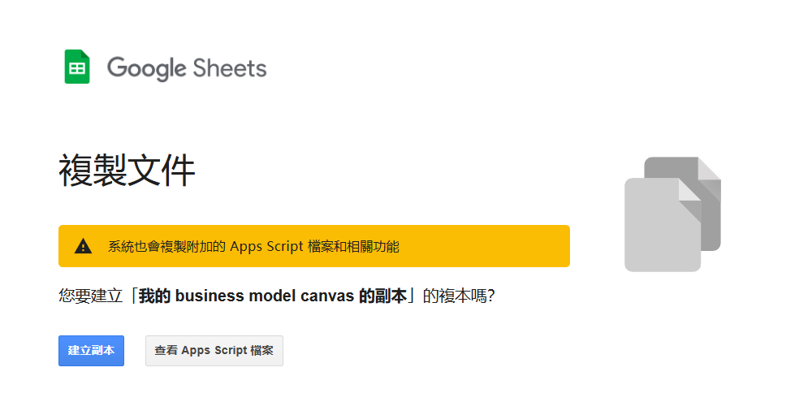

# 輕量級學術與營運策略畫布 (Academic BMC & SWOT Web App)

>  A lightweight Web App for Academic Business Model Canvas and SWOT analysis using Google Sheets & GAS.

> 這是一個利用 **Google Sheets** 作為資料庫、透過 **Google Apps Script (GAS)** 部署的輕量級網頁應用程式。  
>
> 專為需要頻繁調整專案策略、管理核心設施或實驗室營運的研究人員設計。

✅ **免架設伺服器**：你的 Google 雲端硬碟就是後台。

✅ **直覺修改**：像寫便利貼一樣，點擊網頁區塊直接編輯，自動回傳存檔。  

✅ **完全自訂標題**：支援從試算表直接更改九宮格與矩陣的中英文字段。  

✅ **學術友善匯出**：一鍵產生 Quarto (`.qmd`) 原始碼、PDF 或 PNG 圖檔。  

---

## 🚀 部署教學 (1 分鐘完成)

### 步驟一：建立資料庫與程式碼 (一鍵複製)

1. 點擊下方連結，會自動將內建程式碼的資料庫範本複製到你的 Google 雲端硬碟 (全程免費)：
   👉 https://docs.google.com/spreadsheets/d/1ZLwbtcXO2Koy5OcWiN7oZbaF0rReSUskVKp73Zv-StE/copy
   
3. 複製完成後，你可以隨意修改試算表中 **C 欄 (Title)** 的標題文字，打造你專屬的畫布欄位。
4. 在這邊不用編輯 **B欄 (content)** 的內容，我們等步驟三發佈後，直接在網頁上填寫。

### 步驟二：發布網頁應用程式

1. 在複製好的試算表上方選單，點擊 **「擴充功能」 > 「Apps Script」**。
2. 進入編輯器後，你會看到程式碼已經自動準備好了！請直接點擊右上角藍色的 **「部署」 > 「新增部署作業」**。
3. 左上角齒輪點選 **「網頁應用程式」**。
4. **執行身分** 選「我」，**誰可以存取** 選「只有我」(保護你的資料隱私)。
5. 點擊「部署」，完成 Google 帳號授權後，系統會產生一段網址。點擊網址即可開始使用你的專屬畫布！

### 步驟三：發布與授權

1. 點擊右上角藍色的 **「部署」 > 「新增部署作業」**。
2. 左上角齒輪點選 **「網頁應用程式」**。
3. **執行身分** 選「我」，**誰可以存取** 選「只有我」(保護你的資料隱私)。
4. 點擊「部署」，完成 Google 帳號授權後，系統會產生一段網址。點擊網址即可開始使用！

---

## ❤️ 支持這個專案 (How to Support This Project)

如果這個畫布工具幫助你釐清了實驗室的營運方向，或節省了你整理計畫書的時間，歡迎透過以下方式支持我的持續開發與研究：

### ☕ 1. 贊助支持 (Sponsor This Project)

開發與維護開源工具需要投入許多業餘時間。如果你覺得工具好用，歡迎給我一點鼓勵！

### 📄 2. 學術引用 (Citation)

身為生醫研究人員，若你在研究或設施管理中使用了本工具，或對單細胞轉錄體 (scRNA-seq)、Nanopore 定序有興趣，歡迎參考或與我討論。

---

## ⚠️ 免責聲明 (Disclaimer)

* 本專案為開發者基於個人興趣於非工作時間所開發之開源輔助工具，**與所屬之研究機構或任職單位無關**。  
* 專案採「現狀 (as-is)」提供，開發者與所屬機構不承擔系統維護、資料保管或任何損害賠償責任。

* 使用者應自行妥善保管機密策略與資料。
